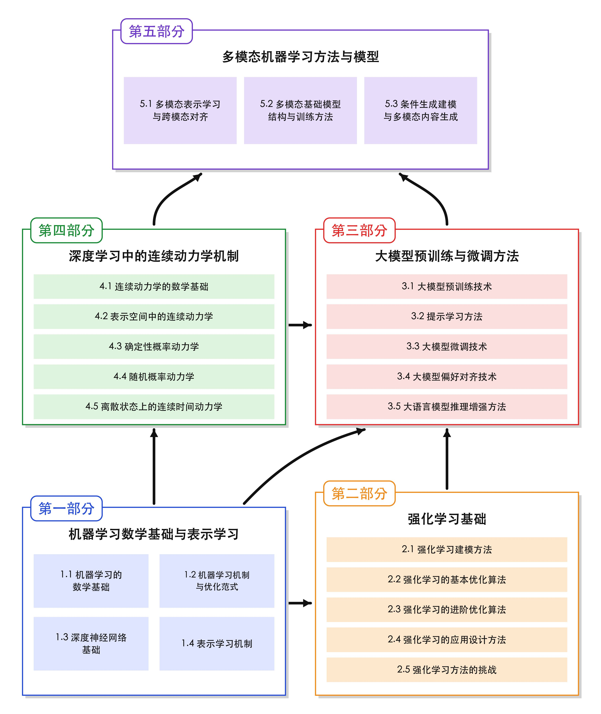

# **高级机器学习**
# **Advanced Machine Learning**

*作者团队：东北大学自然语言处理实验室师生*  
*单位：东北大学自然语言处理实验室 (NEUNLPLab) / 小牛翻译 (NiuTrans Research)*  

这是一本面向生成式人工智能时代的高级机器学习教材，主要对现代机器学习中的基础理论、核心方法和前沿技术进行较为系统的介绍，并进一步覆盖强化学习、大模型训练与对齐、连续动力学、扩散建模以及多模态学习等内容。与传统机器学习教材相比，本书更加关注近年来生成式人工智能发展过程中形成的新方法与新问题，同时尽量通过具体示例、图示和直观解释帮助读者理解较为抽象的理论与算法。其内容可供计算机、人工智能、自然语言处理等相关专业的高年级本科生及研究生学习使用，也可作为相关研究人员了解现代机器学习方法体系的参考资料。



本书按照从基础到前沿的思路组织内容，整体覆盖机器学习数学基础与表示学习、强化学习、大模型预训练与微调、生成建模与连续动力学、多模态机器学习等主要方向，形成一条较为完整的学习路线。除教材正文外，本书还配套各章节对应的Slides和课后习题，便于课堂教学、自主学习与复习巩固。

## 完整PDF版

本教材的完整 PDF 版本：[AMLBook.pdf](AMLBook.pdf)

## 教材目录

<a href="AMLBook.pdf#page=6" title="第一章 机器学习数学基础与表示学习">1. 机器学习数学基础与表示学习</a> [[slides]](slides/第一章.pdf)


- 1.1 机器学习的数学基础

  - 1.1.1 张量代数与线性对象
  - 1.1.2 高级矩阵微积分与计算图
  - 1.1.3 凸优化理论与训练目标
  - 1.1.4 高维数据的表示与计算
- 1.2 机器学习机制与优化范式

  - 1.2.1 监督学习、无监督学习与自监督学习
  - 1.2.2 机器学习建模机制
  - 1.2.3 优化算法与训练过程
  - 1.2.4 模型评估与模型选择
  - 1.2.5 正则化机制
- 1.3 深度神经网络基础

  - 1.3.1 多层感知机机制
  - 1.3.2 自注意力机制
  - 1.3.3 Encoder/Decoder 结构
- 1.4 表示学习机制

  - 1.4.1 分布式表示
  - 1.4.2 特征映射与表示空间
  - 1.4.3 预训练与表示迁移
- 1.5 本章小结

<a href="AMLBook.pdf#page=58" title="第二章 强化学习基础">2. 强化学习基础</a> [[slides]](slides/第二章.pdf)


- 2.1 强化学习建模方法

  - 2.1.1 马尔可夫决策过程
  - 2.1.2 关键元素介绍
  - 2.1.3 优化目标
- 2.2 强化学习的基本优化算法

  - 2.2.1 基于价值函数的方法
  - 2.2.2 基于策略优化的方法
  - 2.2.3 Actor-Critic 框架
- 2.3 强化学习的进阶优化算法

  - 2.3.1 近端策略优化方法
  - 2.3.2 离线强化学习方法
- 2.4 强化学习的应用设计方法

  - 2.4.1 任务边界与转移定义
  - 2.4.2 状态表示与动作空间
  - 2.4.3 奖励与约束
  - 2.4.4 训练与评估过程设计
- 2.5 强化学习方法的挑战

  - 2.5.1 面向大规模决策的挑战
  - 2.5.2 强化学习训练的不稳定性和泛化性问题
  - 2.5.3 强化学习方法的奖励构建问题
- 2.6 本章小结

<a href="AMLBook.pdf#page=92" title="第三章 大模型预训练与微调方法">3. 大模型预训练与微调方法</a> [[slides]](slides/第三章.pdf)


- 3.1 大模型预训练技术

  - 3.1.1 语言建模方法
  - 3.1.2 大语言模型架构
  - 3.1.3 大语言模型预训练方法
  - 3.1.4 缩放定律
- 3.2 提示学习方法

  - 3.2.1 Zero/One/Few-Shot 提示方法
  - 3.2.2 进阶提示方法
  - 3.2.3 学习提示
- 3.3 大模型微调技术

  - 3.3.1 微调概述
  - 3.3.2 有监督微调方法
  - 3.3.3 高效微调方法
- 3.4 大模型偏好对齐技术

  - 3.4.1 对齐概述
  - 3.4.2 奖励模型构建方法
  - 3.4.3 基于 PPO 的强化学习人类反馈训练
  - 3.4.4 直接偏好优化
  - 3.4.5 偏好数据自动生成
- 3.5 大语言模型推理增强方法

  - 3.5.1 推理概述
  - 3.5.2 测试时缩放
  - 3.5.3 基于可校验奖励的强化学习方法
  - 3.5.4 从推理大模型到智能体
- 3.6 本章小结

<a href="AMLBook.pdf#page=144" title="第四章 深度学习中的连续动力学机制">4. 深度学习中的连续动力学机制</a> [[slides]](slides/第四章.pdf)


- 4.1 连续动力学的数学基础

  - 4.1.1 从离散更新到连续演化
  - 4.1.2 常微分方程
  - 4.1.3 常微分方程的求解：积分表示与数值方法
- 4.2 表示空间中的连续动力学

  - 4.2.1 Transformer 的离散动力学解释
  - 4.2.2 数值积分视角下的网络结构设计
  - 4.2.3 表示动力学的稳定性与刚性
  - 4.2.4 从离散深度到神经常微分方程
  - 4.2.5 神经常微分方程的训练与伴随灵敏度法
- 4.3 确定性概率动力学

  - 4.3.1 从样本轨迹到概率输运
  - 4.3.2 流映射与连续性方程
  - 4.3.3 连续归一化流
  - 4.3.4 Flow Matching
  - 4.3.5 概率路径设计
- 4.4 随机概率动力学

  - 4.4.1 随机微分方程
  - 4.4.2 正向扩散过程
  - 4.4.3 反向 SDE 与分数函数
  - 4.4.4 去噪分数匹配
  - 4.4.5 概率流 ODE
  - 4.4.6 数值采样与高效生成
- 4.5 离散状态上的连续时间动力学

  - 4.5.1 Token序列生成
  - 4.5.2 连续空间中的扩散：嵌入空间扩散
  - 4.5.3 Token空间中的扩散：离散扩散
  - 4.5.4 离散扩散的思考与讨论
  - 4.5.5 本章小结

<a href="AMLBook.pdf#page=221" title="第五章 多模态机器学习方法与模型">5. 多模态机器学习方法与模型</a> [[slides]](slides/第五章.pdf)


- 5.1 多模态表示学习与跨模态对齐

  - 5.1.1 单模态表示学习
  - 5.1.2 自监督学习与预训练表示
  - 5.1.3 跨模态对齐
- 5.2 多模态基础模型结构与训练方法

  - 5.2.1 多模态基础模型的通用结构
  - 5.2.2 视觉语言模型
  - 5.2.3 语音语言模型
  - 5.2.4 多模态指令微调与对齐
  - 5.2.5 图像—语音—文本联合建模
- 5.3 条件生成建模与多模态内容生成

  - 5.3.1 条件生成模型基础
  - 5.3.2 文本生成图像
  - 5.3.3 图像编辑
  - 5.3.4 语音生成
  - 5.3.5 音频与声景生成
  - 5.3.6 跨模态交互生成
- 5.4 本章小结

<!-- ## 源代码

本教材的 LaTeX 源代码位于 [src](src/) 目录。主文件为 [src/aml-notes.tex](src/aml-notes.tex)，完整 PDF 为 [AMLBook.pdf](AMLBook.pdf)。

建议使用 XeLaTeX 编译：

```shell
cd src
xelatex main.tex
bibtex main
xelatex main.tex
``` -->

## 课件

配套课件位于 [slides](slides/) 目录。

## 致谢

感谢所有参与本书编写、整理与配套教学资源建设的小牛团队（部分）成员

杨曦涵、陈丹、吴钰璋、李天园、张俊翔、叶凯阳、王骏鑫、朱梓铭、徐欣怡、赵润松、葛政锟、李恒雨、赵洵、刘宏宇、林丁洋、牛苗赫、兰庭旭、刘晓倩、丁妍、王成龙、肖桐、朱靖波

## 联系我们
有任何问题请联系xiaotong [at] mail.neu.edu.cn （肖桐） 或 wangchenglong [at] mail.neu.edu.cn（王成龙）
